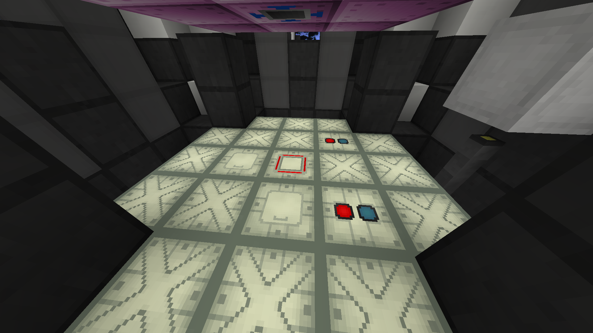
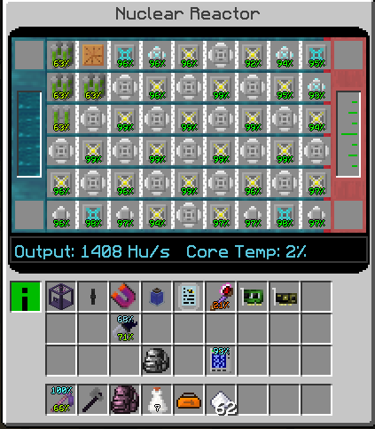
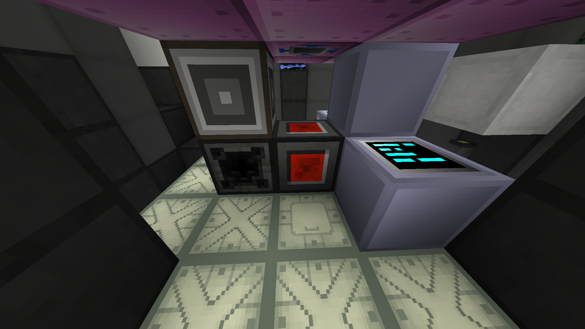
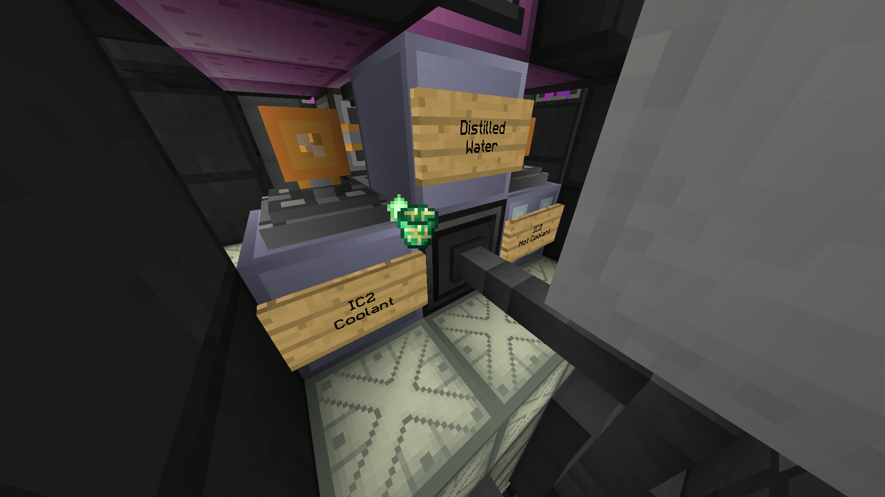
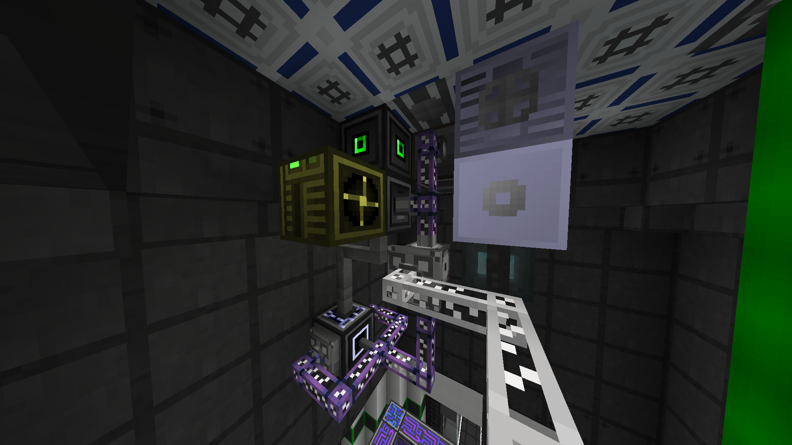
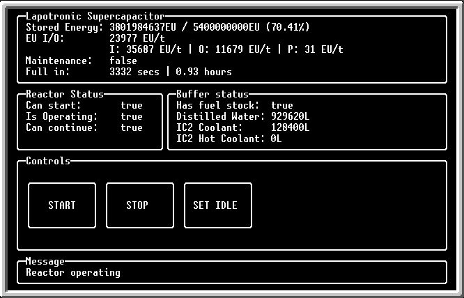

# GTNH Fluid Reactor Manager

A simple OpenComputers script made for handling one or more IC2 fluid nukes in GTNH, based 
on [gtnh_vacuum_reactor](https://github.com/Sopel97/gtnh_vacuum_reactor) by Sopel97.

This program starts or stops your reactor(s) based on the energy amount of a Lapotronic
Supercapacitor, with some extra security measures based on the amount of distilled water,
coolant and fuel rods.

It was specifically made for the 1408HU fluid nuke from the 
[GTNH Wiki](https://gtnh.miraheze.org/wiki/Nuclear_Reactor), but you can
modify it to handle any other configuration.

## Requirements

### Hardware

You will need a computer for each one of your reactors. If you have two or more you
need an extra computer that serves the LSC data and some extra hardware components.

Recomended computer hardware:
- Tier 2 CPU
- Tier 2 GPU
- Tier 2 screen 
- 2x Tier 2 RAM
- Tier 1 HDD

For each reactor, you will need the following:
- 1 Transposer
- 1 Redstone IO
- 1 Adapter (2 if using a single reactor)
- 1 Tank controller
- 2 Super Tanks
- 1 MV Fluid Tank
- 1 ME Interface (Optional)

If you have two or more reactors, you need:
- An extra adapter for the computer connected to the LSC.
- A network card for each computer.
- Some network relays depending on your network configuration. If you use a server instead
of a computer for the LSC connection you can skip this one.
- Some way to connect all the computers to the network, i recommend using P2P tunnels.

You can get away with using a single computer for a single reactor by using the single reactor
script (but i don't support it anymore)

### Reactors

Each reactor needs the following blocks to connect to the computers:
- 2 reactor fluid ports
- 1 reactor redstone control
- At least one reactor access hatch

 

If you are going to use the 1408HU configuration i recommend using these for each reactor:
- 1 heat exchanger
- 3 steam turbines
- 3 superheated steam turbines
- 6 large HSS-E turbine rotors
- 4 Buffered EV dynamo hatches (the 4A ones)
- 4 Fluid regulators, at least IV tier
- 4 GT Fluid tanks, ULV tier should be enough
- A bunch of pumps, at least EV tier
- Some 4x loseless EV cable if you hate transformers for power gen like i do
- An ME controller
- A lot of P2P tunnels for moving fluids around

    

<!-- TODO: Explain this thing and add more images -->

#### Clients
 
 

#### Server
 

## Usage

Install the `fluid-nuke` package from this folder, or copy the files in the paths
specified in the `programs.cfg` file in the root of the repo

Then run one of the following
- `$ reactorserver` for the server
- `$ reactorlcient` for the client
- `$ reactorsingle` for single setup

You can modify the threshold values in `/usr/lib/fluid_nuke/config.lua` if you need to

### Client controls

 

Just click the big START button to turn on the reactor. If you have some kind of problem, 
the program should notify you at the bottom of the screen.

The reactor will stop itself in case of an emergency or enter idle mode if the energy
threshold is reached. You can set these modes manually by clicking the STOP or SET IDLE buttons
